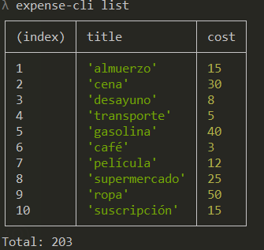
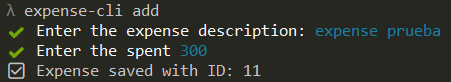
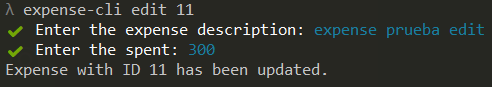
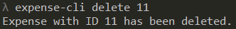

# Expense tracker

It is a CLI application to keep track of your expenses.

## Clone the repository

 - git clone https://github.com/JRDev19/expense_tracker.git
 - npm install
 - npm link

## Commands

- expense-cli list  
    

- expense-cli add  
    

- expense-cli edit <id>  
    

- expense-cli delete <id>  
    

